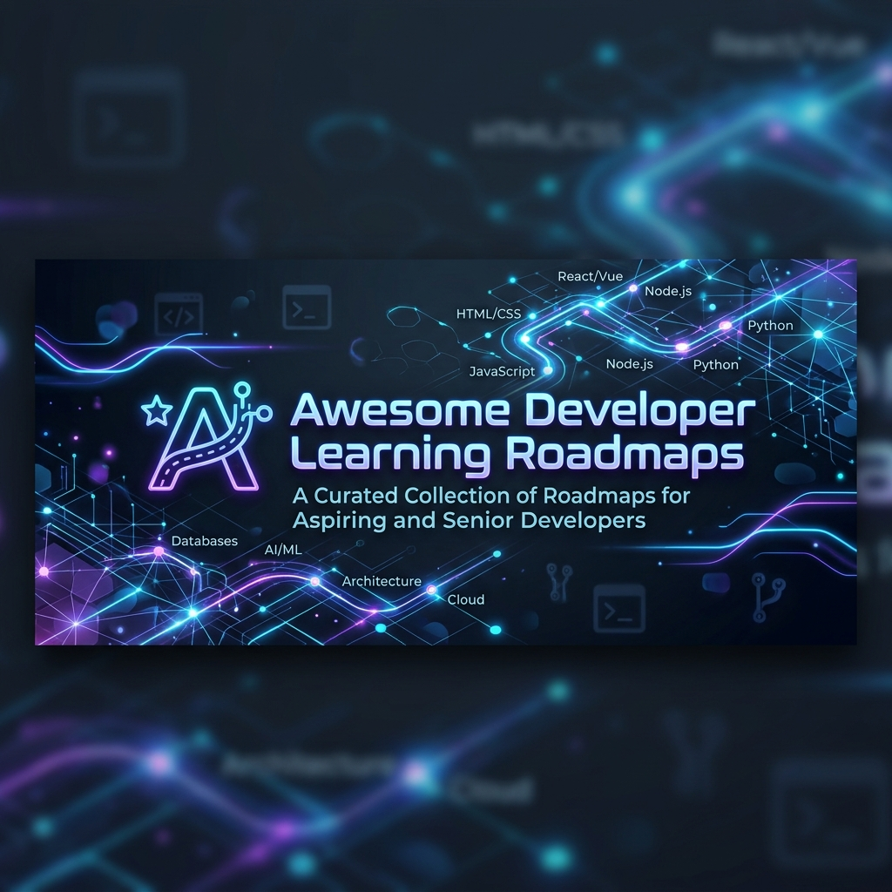

  

  <h1>Awesome Developer Learning Roadmaps 🗺️</h1>

  

    <strong>A meticulously curated collection of structured learning paths to help you master technology.</strong>
  

  

    
    
    
    
    
    
  

  

    <b>📚 150+ Roadmaps &nbsp;•&nbsp; 🚀 50+ Technologies &nbsp;•&nbsp; 🌍 Community Curated &nbsp;•&nbsp; ⭐ Beginner → Expert &nbsp;•&nbsp; 🔄 Regularly Updated</b>
  

 

## Why this repository?

The technology landscape is vast, and navigating it can be overwhelming. This repository is built on a few core principles:

- **Saves time**: Stop endlessly searching for the "best" tutorial. We've done the curation for you.
- **Structured learning**: Follow proven paths instead of getting lost in disjointed, random tutorials.
- **Official & trusted resources**: We prioritize official documentation, renowned universities (Harvard, MIT), and established community standards (Roadmap.sh, OSSU).
- **Beginner friendly**: Clear difficulty indicators help you know exactly where to start.
- **Community maintained**: Continuously updated and peer-reviewed by experienced developers to ensure long-term relevance.

---

## 🚀 Getting Started

If you're unsure where to begin, we recommend following these sequences depending on your desired role. 

### Complete Beginner
1. Git & GitHub
2. HTML
3. CSS
4. JavaScript
5. Frontend Basics
6. Backend Basics
7. Databases
8. System Design

<b>View Paths for Other Roles (Frontend, Backend, Full Stack, Mobile, DevOps, AI, Cybersecurity)</b>

 

**Frontend Developer**
1. HTML, CSS, JavaScript
2. React / Vue / Angular
3. State Management
4. Build Tools & Bundlers
5. CSS Frameworks (Tailwind)
6. Testing & CI/CD

**Backend Developer**
1. Programming Language (Python, Go, Java, Node.js)
2. Relational Databases (PostgreSQL, MySQL)
3. APIs (REST, GraphQL)
4. Caching (Redis)
5. Message Brokers (Kafka, RabbitMQ)
6. Containerization (Docker)

**Full Stack Developer**
1. Frontend Fundamentals
2. Backend Fundamentals
3. System Design
4. Cloud Deployments

**Mobile Developer**
1. UI/UX Principles
2. Platform specific (Swift, Kotlin) or Cross-platform (Flutter, React Native)
3. State Management & Local Storage
4. API Integration
5. App Store Deployment

**DevOps / Cloud Engineer**
1. Linux / OS Concepts
2. Networking & Security
3. Scripting (Bash, Python)
4. Containers (Docker, Kubernetes)
5. CI/CD (GitHub Actions, Jenkins)
6. Cloud Providers & IaC (Terraform, AWS/GCP/Azure)

**AI Engineer**
1. Python
2. Mathematics (Linear Algebra, Calculus, Statistics)
3. Data Processing (Pandas, NumPy)
4. Machine Learning (Scikit-Learn)
5. Deep Learning (PyTorch, TensorFlow)
6. MLOps & Deployment

**Cybersecurity Engineer**
1. IT Fundamentals (OS, Networking)
2. Scripting & Command Line
3. Security Fundamentals & Cryptography
4. Offensive Security (Penetration Testing)
5. Defensive Security (Blue Teaming)
6. Cloud Security

---

## Table of Contents

- [🚀 Getting Started](#-getting-started)
- [⭐ Editor's Picks](#-editors-picks)
- [🔥 Most Popular](#-most-popular)
- [📖 Learning Tips](#-learning-tips)
- [💡 Pro Tips](#-pro-tips)
- [🔗 Additional Learning Platforms](#-additional-learning-platforms)
- [Roadmaps](#roadmaps)
  - [Programming Languages](#programming-languages)
  - [Web Development](#web-development)
  - [Mobile Development](#mobile-development)
  - [Infrastructure & DevOps](#infrastructure--devops)
  - [Cloud](#cloud)
  - [AI & Data](#ai--data)
  - [Cybersecurity](#cybersecurity)
  - [Databases](#databases)
  - [Software Architecture & System Design](#software-architecture--system-design)
  - [Game Development](#game-development)
  - [Miscellaneous](#miscellaneous)
  - [Articles](#articles)
- [🤝 Contributing](#-contributing)
- [📄 License](#-license)

---

## ⭐ Editor's Picks

The top 10 most valuable and highly recommended roadmaps across the entire industry:

1. **[Backend Developer Roadmap](https://roadmap.sh/backend)**: The undisputed gold standard for understanding modern backend engineering, networking, and infrastructure.
2. **[System Design Primer](https://github.com/donnemartin/system-design-primer)**: Absolutely essential reading for understanding scalable architectures and passing high-level technical interviews.
3. **[Frontend Developer Roadmap](https://roadmap.sh/frontend)**: A deeply structured and frequently updated guide that perfectly captures the complex frontend ecosystem.
4. **[DevOps Roadmap](https://roadmap.sh/devops)**: Clarifies the daunting landscape of infrastructure, CI/CD, and monitoring.
5. **[AI Expert Roadmap](https://github.com/AMAI-GmbH/AI-Expert-Roadmap)**: An incredible visual guide mapping out the intersection of data science, statistics, and machine learning.
6. **[Cloud Native Landscape](https://landscape.cncf.io/)**: The best interactive way to navigate the massive CNCF ecosystem.
7. **[React Developer Roadmap](https://roadmap.sh/react)**: The definitive guide for mastering the industry's most popular frontend framework.
8. **[Coding Interview University](https://github.com/jwasham/coding-interview-university)**: A rigorous, multi-month study plan for mastering software engineering fundamentals and algorithms.
9. **[Data Engineer Roadmap](https://roadmap.sh/data-engineer)**: An extremely detailed path covering data lakes, pipelines, and distributed processing systems.
10. **[Cyber Security Roadmap](https://roadmap.sh/cyber-security)**: A structured starting point for navigating the many specialized facets of information security.

---

## 🔥 Most Popular

These roadmaps are heavily starred on GitHub, actively maintained, and widely recommended across the global developer community:

- **[Roadmap.sh (All Paths)](https://roadmap.sh/)**
- **[System Design Primer](https://github.com/donnemartin/system-design-primer)**
- **[Coding Interview University](https://github.com/jwasham/coding-interview-university)**
- **[Awesome Python](https://github.com/vinta/awesome-python)**
- **[Machine Learning Roadmap](https://github.com/mrdbourke/machine-learning-roadmap)**
- **[OSSU Computer Science](https://github.com/ossu/computer-science)**

---

## 📖 Learning Tips

- **Avoid tutorial hell:** Don't just watch videos passively. Write code, break it, and fix it.
- **Build projects:** Practical application is the only way to cement theoretical knowledge. Build things that solve actual problems.
- **Read official documentation:** It is the most accurate, comprehensive, and up-to-date source of truth. Get comfortable reading it early.
- **Take notes:** Document your learning process. Create cheat sheets or a digital garden.
- **Practice consistently:** Daily coding for 30 minutes is vastly superior to infrequent 5-hour marathon sessions.
- **Contribute to open source:** It dramatically improves your code-reading skills and provides real-world collaboration experience.

## 💡 Pro Tips

- **How to stay motivated:** Track your progress visually (like GitHub contribution graphs) and focus on small, daily wins. Don't compare your day 10 to someone else's year 5.
- **How to choose a roadmap:** Pick *one* primary roadmap and stick with it until you've built at least two non-trivial projects using those technologies.
- **When to build projects:** Immediately. As soon as you learn a concept (like loops, or state, or routing), build a tiny project that uses only that concept.

---

## 🔗 Additional Learning Platforms

Curated platforms that offer high-quality, structured curriculums:

- [roadmap.sh](https://roadmap.sh): The definitive community-driven educational paths and visual guides.
- [freeCodeCamp](https://www.freecodecamp.org/): A massive, free, project-based curriculum spanning web development, data, and security.
- [OSSU (Open Source Society University)](https://github.com/ossu/computer-science): A rigorous path to a free self-taught education in Computer Science using university courses.
- [The Odin Project](https://www.theodinproject.com/): An incredible open-source full stack curriculum that forces you to build real projects.
- [Microsoft Learn](https://learn.microsoft.com/): Interactive, hands-on learning for Microsoft technologies and general cloud concepts.
- [Google Developers](https://developers.google.com/learn): Official learning pathways for Google tools, Android, and web frameworks.
- [MDN Web Docs](https://developer.mozilla.org/): The absolute standard for web documentation (HTML, CSS, JS).
- [Harvard CS50](https://cs50.harvard.edu/): The legendary introduction to the intellectual enterprises of computer science.
- [MIT OpenCourseWare](https://ocw.mit.edu/): Free, unrestricted access to MIT course content and lectures.
- [Full Stack Open](https://fullstackopen.com/en/): A deep dive into modern web development created by the University of Helsinki.

---

## Roadmaps

> **Legend:**
> - **Difficulty:** 🟢 Beginner | 🟡 Intermediate | 🟠 Advanced | 🔴 Expert
> - **Resource Type:** 🌐 Website | 📂 GitHub | 📄 PDF | 🎥 Video | 📚 Documentation | 🎓 Course | 🛠 Interactive

### Programming Languages

View Programming Language Roadmaps

 

| Roadmap | Difficulty | Estimated Time | Resource Type | Last Updated | Rating | Description |
|---|---|---|---|---|---|---|
| [Python Developer](https://roadmap.sh/python) | 🟢 Beginner → 🟠 Advanced | 3–5 Months | 🌐 Website | 2024 | ⭐⭐⭐⭐⭐ | Comprehensive roadmap covering Python fundamentals, OOP, libraries, testing, and advanced concepts. |
| [Go Developer](https://github.com/Alikhll/golang-developer-roadmap) | 🟡 Intermediate → 🟠 Advanced | 2–4 Months | 📂 GitHub | 2024 | ⭐⭐⭐⭐⭐ | Visual guide to becoming a Go developer and understanding the concurrent ecosystem. |
| [Java Developer](https://roadmap.sh/java) | 🟢 Beginner → 🟠 Advanced | 4–6 Months | 🌐 Website | 2024 | ⭐⭐⭐⭐⭐ | Step-by-step guide to mastering Java, the JVM, and enterprise frameworks like Spring. |
| [C++ Developer](https://roadmap.sh/cpp) | 🟡 Intermediate → 🔴 Expert | 4–6 Months | 🌐 Website | 2024 | ⭐⭐⭐⭐⭐ | Learning path for modern C++ development, memory management, and performance. |
| [Rust Developer (Rustlings)](https://github.com/rust-lang/rustlings) | 🟢 Beginner → 🟡 Intermediate | 1–3 Months | 📂 GitHub | 2024 | ⭐⭐⭐⭐⭐ | Interactive exercises to get you used to reading and writing Rust code safely. |
| [JavaScript (MDN)](https://developer.mozilla.org/en-US/docs/Web/JavaScript/Guide) | 🟢 Beginner → 🟠 Advanced | 2–4 Months | 📚 Documentation | 2024 | ⭐⭐⭐⭐⭐ | The official and most accurate guide to learning JavaScript from the creators of the web. |

### Web Development

View Web Development Roadmaps

 

| Roadmap | Difficulty | Estimated Time | Resource Type | Last Updated | Rating | Description |
|---|---|---|---|---|---|---|
| [Frontend Developer](https://roadmap.sh/frontend) | 🟢 Beginner → 🟡 Intermediate | 4–6 Months | 🌐 Website | 2024 | ⭐⭐⭐⭐⭐ | Step-by-step guide to becoming a modern frontend developer, covering HTML, CSS, JS, and frameworks. |
| [Backend Developer](https://roadmap.sh/backend) | 🟡 Intermediate → 🟠 Advanced | 5–7 Months | 🌐 Website | 2024 | ⭐⭐⭐⭐⭐ | Detailed path covering servers, databases, APIs, caching, and infrastructure. |
| [Full Stack Developer](https://roadmap.sh/full-stack) | 🟡 Intermediate → 🔴 Expert | 8–12 Months | 🌐 Website | 2024 | ⭐⭐⭐⭐⭐ | End-to-end guide to becoming a versatile full stack developer capable of shipping entire products. |
| [React Developer](https://roadmap.sh/react) | 🟡 Intermediate | 2–4 Months | 🌐 Website | 2024 | ⭐⭐⭐⭐⭐ | Guide to mastering the React ecosystem, state management, routing, and SSR/SSG. |
| [Vue Developer](https://roadmap.sh/vue) | 🟡 Intermediate | 2–3 Months | 🌐 Website | 2024 | ⭐⭐⭐⭐⭐ | Path to becoming proficient in Vue.js, Vuex/Pinia, and its surrounding tooling. |

### Mobile Development

View Mobile Development Roadmaps

 

| Roadmap | Difficulty | Estimated Time | Resource Type | Last Updated | Rating | Description |
|---|---|---|---|---|---|---|
| [Android Developer](https://roadmap.sh/android) | 🟢 Beginner → 🟡 Intermediate | 4–6 Months | 🌐 Website | 2024 | ⭐⭐⭐⭐⭐ | Complete learning path for native Android development using Kotlin and Jetpack Compose. |
| [iOS Developer](https://roadmap.sh/ios) | 🟢 Beginner → 🟡 Intermediate | 4–6 Months | 🌐 Website | 2024 | ⭐⭐⭐⭐⭐ | Step-by-step guide to becoming an iOS developer using Swift and SwiftUI. |
| [Flutter Developer](https://roadmap.sh/flutter) | 🟢 Beginner → 🟡 Intermediate | 3–5 Months | 🌐 Website | 2024 | ⭐⭐⭐⭐⭐ | Comprehensive guide to cross-platform mobile development with Flutter and Dart. |
| [React Native](https://roadmap.sh/react-native) | 🟡 Intermediate | 3–5 Months | 🌐 Website | 2024 | ⭐⭐⭐⭐⭐ | Guide to building mobile applications using React Native and Expo. |

### Infrastructure & DevOps

View Infrastructure & DevOps Roadmaps

 

| Roadmap | Difficulty | Estimated Time | Resource Type | Last Updated | Rating | Description |
|---|---|---|---|---|---|---|
| [DevOps Engineer](https://roadmap.sh/devops) | 🟡 Intermediate → 🔴 Expert | 6–8 Months | 🌐 Website | 2024 | ⭐⭐⭐⭐⭐ | Step-by-step guide for CI/CD, cloud architecture, monitoring, and automation. |
| [Kubernetes Learning Path](https://kubernetes.io/docs/tutorials/) | 🟠 Advanced → 🔴 Expert | 2–4 Months | 📚 Documentation | 2024 | ⭐⭐⭐⭐⭐ | Official tutorials and paths for mastering Kubernetes container orchestration. |

### Cloud

View Cloud Roadmaps

 

| Roadmap | Difficulty | Estimated Time | Resource Type | Last Updated | Rating | Description |
|---|---|---|---|---|---|---|
| [Cloud Native Landscape](https://landscape.cncf.io/) | 🟡 Intermediate → 🔴 Expert | 4–6 Months | 🌐 Website | 2024 | ⭐⭐⭐⭐⭐ | Interactive landscape and roadmap for navigating CNCF Cloud Native technologies. |
| [AWS Solutions Architect](https://aws.amazon.com/certification/certified-solutions-architect-associate/) | 🟡 Intermediate | 2–3 Months | 🌐 Website | 2024 | ⭐⭐⭐⭐⭐ | Official guide and resources to passing the AWS Solutions Architect Associate certification exam. |

### AI & Data

View AI & Data Roadmaps

 

| Roadmap | Difficulty | Estimated Time | Resource Type | Last Updated | Rating | Description |
|---|---|---|---|---|---|---|
| [AI Expert Roadmap](https://github.com/AMAI-GmbH/AI-Expert-Roadmap) | 🟡 Intermediate → 🔴 Expert | 8–12 Months | 📂 GitHub | 2023 | ⭐⭐⭐⭐⭐ | Visual roadmap to becoming an Artificial Intelligence and Machine Learning expert. |
| [Data Engineer](https://roadmap.sh/data-engineer) | 🟡 Intermediate → 🟠 Advanced | 6–8 Months | 🌐 Website | 2024 | ⭐⭐⭐⭐⭐ | Step-by-step guide covering data processing, storage, data warehouses, and pipelines. |
| [Data Analyst](https://roadmap.sh/data-analyst) | 🟢 Beginner → 🟡 Intermediate | 3–5 Months | 🌐 Website | 2024 | ⭐⭐⭐⭐⭐ | Path to learning SQL, Python/R, statistical analysis, and data visualization tools. |
| [Machine Learning](https://github.com/mrdbourke/machine-learning-roadmap) | 🟡 Intermediate → 🟠 Advanced | 6–8 Months | 📂 GitHub | 2022 | ⭐⭐⭐⭐⭐ | A roadmap connecting the most important concepts, mathematics, and tools in ML. |

### Cybersecurity

View Cybersecurity Roadmaps

 

| Roadmap | Difficulty | Estimated Time | Resource Type | Last Updated | Rating | Description |
|---|---|---|---|---|---|---|
| [Cyber Security](https://roadmap.sh/cyber-security) | 🟢 Beginner → 🔴 Expert | 6–10 Months | 🌐 Website | 2024 | ⭐⭐⭐⭐⭐ | A comprehensive roadmap covering defensive and offensive security principles and networking. |
| [Web Security](https://github.com/ossamayasserr/WebAppPentestRoadmap) | 🟡 Intermediate → 🟠 Advanced | 4–6 Months | 📂 GitHub | 2024 | ⭐⭐⭐⭐⭐ | A focused roadmap for web application security, OWASP top 10, and penetration testing. |

### Databases

View Database Roadmaps

 

| Roadmap | Difficulty | Estimated Time | Resource Type | Last Updated | Rating | Description |
|---|---|---|---|---|---|---|
| [SQL Roadmap](https://roadmap.sh/sql) | 🟢 Beginner → 🟠 Advanced | 2–4 Months | 🌐 Website | 2024 | ⭐⭐⭐⭐⭐ | Step-by-step guide to mastering SQL and relational databases. |
| [MongoDB Roadmap](https://roadmap.sh/mongodb) | 🟢 Beginner → 🟡 Intermediate | 1–3 Months | 🌐 Website | 2024 | ⭐⭐⭐⭐⭐ | Guide to mastering the leading NoSQL document database. |

### Software Architecture & System Design

View Architecture Roadmaps

 

| Roadmap | Difficulty | Estimated Time | Resource Type | Last Updated | Rating | Description |
|---|---|---|---|---|---|---|
| [System Design Primer](https://github.com/donnemartin/system-design-primer) | 🟡 Intermediate → 🔴 Expert | 2–4 Months | 📂 GitHub | 2024 | ⭐⭐⭐⭐⭐ | Learn how to design large-scale, highly available systems and ace system design interviews. |
| [Software Architect Roadmap](https://roadmap.sh/software-architect) | 🟠 Advanced → 🔴 Expert | 6–12 Months | 🌐 Website | 2024 | ⭐⭐⭐⭐⭐ | Guide to transitioning from senior developer to software architect. |

### Game Development

View Game Development Roadmaps

 

| Roadmap | Difficulty | Estimated Time | Resource Type | Last Updated | Rating | Description |
|---|---|---|---|---|---|---|
| [Game Developer](https://roadmap.sh/game-developer) | 🟢 Beginner → 🟠 Advanced | 6–12 Months | 🌐 Website | 2024 | ⭐⭐⭐⭐⭐ | Comprehensive path covering game engines, 3D mathematics, physics, and game design. |

### Miscellaneous

View Miscellaneous Roadmaps

 

| Roadmap | Difficulty | Estimated Time | Resource Type | Last Updated | Rating | Description |
|---|---|---|---|---|---|---|
| [Blockchain Developer](https://roadmap.sh/blockchain) | 🟡 Intermediate → 🟠 Advanced | 4–6 Months | 🌐 Website | 2024 | ⭐⭐⭐⭐⭐ | Guide to becoming a Web3, cryptography, and smart contract developer. |
| [QA Engineer Roadmap](https://roadmap.sh/qa) | 🟢 Beginner → 🟡 Intermediate | 3–5 Months | 🌐 Website | 2024 | ⭐⭐⭐⭐⭐ | Step-by-step guide to software testing, automation, and quality assurance. |

### Articles

View Article-Based Plans

 

| Roadmap | Difficulty | Estimated Time | Resource Type | Last Updated | Rating | Description |
|---|---|---|---|---|---|---|
| [Software Engineer Plan](https://github.com/jwasham/coding-interview-university) | 🟢 Beginner → 🟠 Advanced | 6–12 Months | 📂 GitHub | 2024 | ⭐⭐⭐⭐⭐ | A complete computer science study plan meant for self-taught software engineers. |

---

## 🤝 Contributing

Contributions make the open source community such an amazing place to learn, inspire, and create. Any contributions you make are **greatly appreciated**.

We maintain strict quality control to ensure this repository remains a premium resource. 
Please read our [Contribution Guidelines](CONTRIBUTING.md) to understand our curation standards, table formatting requirements, and PR process.

Before opening a PR, check our [Code of Conduct](CODE_OF_CONDUCT.md).

## 📄 License

Distributed under the MIT License. See `LICENSE` for more information.
